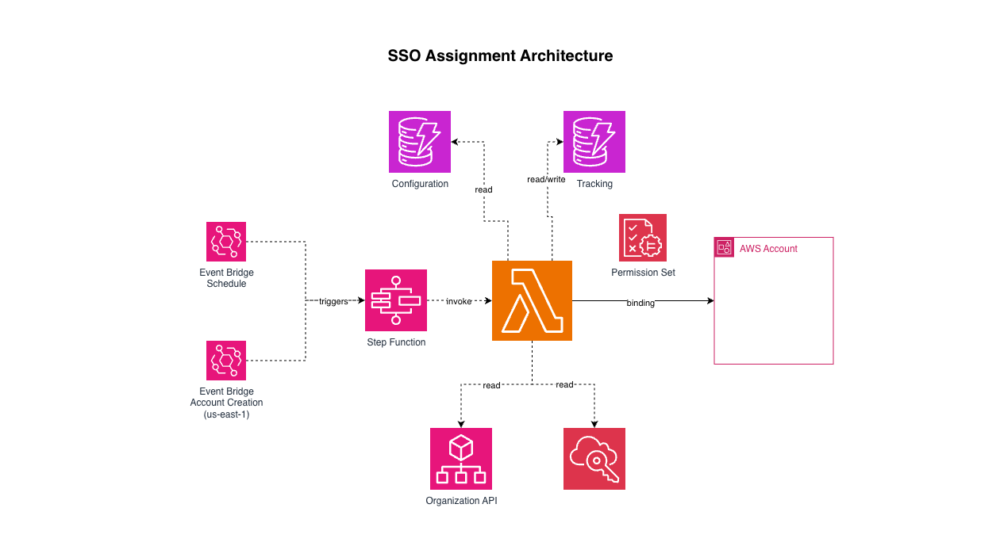

# Terraform AWS SSO Assignment

This Terraform module deploys automation for **AWS IAM Identity Center (SSO)** account assignments. You define **permission-set templates** in **DynamoDB** (via [`modules/config`](./modules/config/)): template name → list of permission set names.

**Account-level templates** allow you to auto-provision SSO assignments based on account **naming conventions**, **organizational units**, or **tags**. Account-level templates can bind **both groups and users** directly to accounts (useful for ad-hoc / one-off assignments).

**EventBridge** runs the flow on a schedule and on new account creation; **Step Functions** adds retries and optional **SNS** failure notifications.

Use it when you want repeatable, infrastructure-as-code driven SSO assignments across many accounts without hand-managing each assignment in the console.

## Features

- **Account-level templates** (NEW): Automatically apply templates to accounts matching **organizational unit paths**, **account name patterns**, or **account tags**. Uses logical AND matching: all conditions in a matcher must match for the template to apply.
- **Account-level user bindings**: Account-level templates can also include a `users` list, which assigns the template's permission sets directly to **Identity Center users** (resolved via Identity Store APIs). This is intended for **ad-hoc** access; at scale, prefer groups.
- **Declarative templates**: The [`modules/config`](./modules/config/) submodule writes templates and account matchers to DynamoDB.
- **Reconciliation**: Matching rules contribute bindings that are reconciled each run.
- **Two trigger modes**: Scheduled reconciliation (default `rate(180 minutes)`) and organization account-creation events (CloudTrail on `CreateAccount`).
- **Resilient orchestration**: Step Functions retries Lambda tasks (3 attempts, exponential backoff).
- **Optional alerting**: If you set `sns_topic_arn`, failed runs can publish error details to your existing SNS topic.
- **Optional event stream**: If you set `events_sns_topic_arn`, the Lambda publishes assignment lifecycle events (created/deleted) to your existing SNS topic.
- **Flexible operations**: Tune Lambda memory, timeout, runtime, CloudWatch log retention, and DynamoDB billing mode.
- **Packaged handler**: Python Lambda source lives under [`assets/functions/`](./assets/functions/) (JSON logging, unit tests alongside the handler).

## Architecture



### Components

| Piece            | Role                                                                                                                                                                       |
| ---------------- | -------------------------------------------------------------------------------------------------------------------------------------------------------------------------- |
| Root module      | DynamoDB table, Lambda (via [terraform-aws-modules/lambda/aws](https://github.com/terraform-aws-modules/terraform-aws-lambda)), Step Functions, EventBridge rules and IAM. |
| `modules/config` | Populates DynamoDB: stores templates and account matchers.                                                                                                                 |
| Lambda           | Reads account details (OU path, name, tags), evaluates account matchers, and assigns permission sets to named IC groups (`assets/functions/handler.py`).                   |

## Usage

### Prerequisites

- Terraform **>= 1.0** and AWS provider **>= 6.0** (see `terraform.tf`).
- IAM Identity Center enabled; permission sets and groups already exist (this module assigns groups to accounts—it does not create permission sets or IdP groups).
- For `account_templates.users`, the referenced users must already exist in the Identity Store (Identity Center directory).
- Credentials with rights to deploy Lambda, DynamoDB, Step Functions, EventBridge, IAM, and (for the handler) SSO Admin, Organizations, and Identity Store actions.
- SSO instance ARN, for example:

  ```bash
  aws sso-admin list-instances --query 'Instances[0].InstanceArn' --output text
  ```

### Example 1 — Minimal stack (root module + config)

The root module creates the runtime; you almost always pair it with `modules/config` so DynamoDB contains your groups.

```hcl
locals {
  # Configuration with templates
  configuration = {
    templates = {
      default = {
        permission_sets = ["OrgReadOnly", "Developer-ReadOnly"]
        description     = "Baseline access — e.g. Grant/default = Platform-ReadOnly,App-Developers"
      }
      breakglass = {
        permission_sets = ["BreakGlassAdmin"]
        description     = "Use tag Grant/breakglass = SRE-Lead only where needed"
      }
    }
    # Optional: Account-level template matchers
    account_templates = {}
  }

  sso_instance_arn = "arn:aws:sso:::instance/ssoins-xxxxxxxx"
}

module "sso_assignment" {
  # Pin a ref in production, e.g. ?ref=v1.0.0 — or use a relative path as in examples/basic.
  source = "git::https://github.com/appvia/terraform-aws-sso-assignment.git"

  sso_instance_arn = local.sso_instance_arn
  tags = {
    Project = "sso-assignment"
  }
}

module "config" {
  source = "git::https://github.com/appvia/terraform-aws-sso-assignment.git//modules/config"

  dynamodb_table_arn = module.sso_assignment.config_dynamodb_table_arn
  configuration      = local.configuration
}
```

### Example 2 — Account-level templates with OU matching

Auto-provision production accounts with baseline permissions based on organizational unit:

```hcl
locals {
  configuration = {
    templates = {
      production = {
        permission_sets = ["Administrator", "ReadOnly"]
        description     = "Production account base permissions"
      }
      development = {
        permission_sets = ["Developer", "ReadOnly"]
        description     = "Development account permissions"
      }
    }
    account_templates = {
      prod_baseline = {
        description = "Auto-provision production accounts by OU"
        matcher = {
          # Matches accounts whose OU path matches the pattern.
          # OU paths are normalized to include a leading "/" before matching, so
          # patterns can (and should) include a leading "/".
          # This pattern matches e.g. "/production/accounts/prod-workload-1".
          organizational_units = ["/production/accounts/*"]
        }
        template_names = ["production"]
        groups         = ["ProdEngineers"]
        # Optional: direct user principals (account templates only)
        # users          = ["alice@example.com"]
      }

      dev_baseline = {
        description = "Auto-provision development accounts"
        matcher = {
          name_patterns = ["dev-*"]
        }
        template_names = ["development"]
        groups         = ["DevEngineers"]
        # users         = ["bob@example.com"]
      }
    }
  }

  sso_instance_arn = "arn:aws:sso:::instance/ssoins-xxxxxxxx"
}

module "sso_assignment" {
  source = "git::https://github.com/appvia/terraform-aws-sso-assignment.git"

  sso_instance_arn = local.sso_instance_arn
  tags = {
    Project = "sso-assignment"
  }
}

module "config" {
  source = "git::https://github.com/appvia/terraform-aws-sso-assignment.git//modules/config"

  dynamodb_table_arn = module.sso_assignment.config_dynamodb_table_arn
  configuration      = local.configuration
}
```

### Example 3 — Account-level templates with tag matching

Auto-provision any account with specific tags (all conditions must match):

```hcl
locals {
  configuration = {
    templates = {
      managed_baseline = {
        permission_sets = ["ReadOnly", "Audit"]
        description     = "Baseline managed permissions"
      }
    }
    account_templates = {
      managed_by_tags = {
        description = "Auto-provision accounts with management tags (AND logic)"
        matcher = {
          account_tags = {
            Environment = "Production"
            ManagedBySSO = "true"
          }
        }
        template_names = ["managed_baseline"]
        groups         = ["Operations"]
        # users        = ["platform-oncall@example.com"]
      }
    }
  }

  sso_instance_arn = "arn:aws:sso:::instance/ssoins-xxxxxxxx"
}
```

### Example 4 — Named resources, schedule, and failure notifications

Use `name` to prefix resources (default is `lz-sso`). Point `sns_topic_arn` at a topic you already manage; the state machine publishes there when the Lambda response includes errors.

```hcl
module "sso_assignment" {
  source = "git::https://github.com/appvia/terraform-aws-sso-assignment.git"

  name             = "my-org-sso"
  sso_instance_arn = local.sso_instance_arn
  step_function_schedule = "rate(30 minutes)"

  lambda_timeout  = 120
  lambda_memory   = 1024

  sns_topic_arn = aws_sns_topic.sso_alerts.arn

  tags = {
    Environment = "production"
  }
}

module "config" {
  source = "git::https://github.com/appvia/terraform-aws-sso-assignment.git//modules/config"

  dynamodb_table_arn = module.sso_assignment.config_dynamodb_table_arn
  configuration      = local.configuration
}
```

### Example 5 — Run the repository example

From the clone:

```bash
cd examples/basic
# Set local.sso_instance_arn in main.tf (or extend the example with tfvars)
terraform init
terraform plan
terraform apply
```

See [examples/basic/README.md](./examples/basic/README.md) for more detail.

### Example 6 — Assignment lifecycle SNS events (created/deleted)

To publish a generic event envelope for account assignment **creation** and **deletion**, provide an SNS topic ARN that already exists. This is **independent** of `sns_topic_arn` (Step Functions failure notifications).

```hcl
module "sso_assignment" {
  source = "git::https://github.com/appvia/terraform-aws-sso-assignment.git"

  sso_instance_arn = local.sso_instance_arn

  # Optional: publish lifecycle events (topic must already exist)
  events_sns_topic_arn = aws_sns_topic.assignment_events.arn
}
```

#### Event schema (SNS `Message`)

The Lambda publishes JSON with:

- `event_type`: `AccountAssignmentCreated` or `AccountAssignmentDeleted`
- `timestamp`: ISO-8601 UTC timestamp
- `detail`: metadata about the assignment (account, group/principal, permission set, template)

## Configuration

### Templates and Account Templates

The `configuration` variable (on `modules/config`) contains:

```hcl
configuration = {
  templates = {
    template_name = {
      permission_sets = ["PermissionSet1", "PermissionSet2"]
      description     = "Description of this template"
    }
  }

  account_templates = {
    matcher_name = {
      description = "Description of this account matcher"
      matcher = {
        # At least ONE of the following must be specified (others are optional)
        # All specified conditions must match (logical AND)

        organizational_units = ["/prod/*"]            # OU path glob patterns (leading "/" required; see matcher details below)
        name_patterns        = ["prod-*", ".*-prod"]  # Account name glob/regex patterns (ANY can match)
        account_tags         = {                                 # Account tags (all must match)
          Environment = "Production"
          ManagedBySSO = "true"
        }
      }
      template_names = ["template_name"]  # Which templates to apply
      groups         = ["GroupName"]      # Which groups from those templates
    }
  }
}
```

### Account Template Matcher Details

**Organizational Units** — Match by trailing OU path with glob patterns:

- The Lambda fetches the account's OU path from AWS Organizations (commonly like `/data/development`, but may also include a root id segment like `r-abc/...` depending on source).
- Before matching, the OU path is normalized to a consistent form with a single leading `/` (e.g. `r-abc/ou-prod/ou-workloads` becomes `/ou-prod/ou-workloads`).
- Patterns are matched against this normalized path using Python [`fnmatch`](https://docs.python.org/3/library/fnmatch.html) (shell-style globs: `*` matches any characters, `?` matches one character).
- **Include the leading `/` in your patterns** (e.g. `"/data/*"`). Patterns without a leading `/` are not supported.
- An account in OU `/data/development` is matched by `/data/*`, `/data/development`, or `/data/d*`.
- At least one pattern must match for the condition to pass.

**Account Name** — Match by account name with glob pattern:

- Single pattern string (e.g. `prod-*`)
- Uses fnmatch glob syntax

**Account Tags** — Match by account tags with AND logic:

- All specified tags must exist on the account
- All values must match exactly (case-sensitive)
- If no tags specified, this condition is skipped

### Migration from old `groups_configuration`

If you have existing Terraform using `groups_configuration` directly:

```hcl
# OLD (no longer supported)
module "config" {
  groups_configuration = {
    default = { ... }
  }
}

# NEW
module "config" {
  configuration = {
    templates = {
      default = { ... }
    }
    account_templates = {}  # Add account matchers here if desired
  }
}
```

### Configuration notes

- **`configuration`** (on `modules/config`): Contains `templates` (top-level keys are template names) and optional `account_templates` (name → matcher + template references). See [modules/config/README.md](./modules/config/README.md).

## Module layout

```
terraform-aws-sso-assignment/
├── main.tf, variables.tf, outputs.tf, locals.tf, data.tf, terraform.tf
├── dynamodb.tf, lambda.tf, step_function.tf, eventbridge.tf
├── assets/functions/          # Lambda (handler.py, tests)
├── modules/config/            # DynamoDB item population
└── examples/basic/            # End-to-end sample
```

## Workflow behavior

1. **Schedule**: EventBridge invokes the Step Functions workflow on `step_function_schedule`; the Lambda lists target accounts, reads each account’s OU path and tags, evaluates account templates, reads each account’s `<prefix>/*` tags, and reconciles assignments against DynamoDB templates.
2. **New account**: An EventBridge rule matches Organizations `CreateAccount` CloudTrail events and starts the same state machine so new accounts can be included in the next reconciliation.

### Region note (important): Organizations `CreateAccount` events are in `us-east-1`

The **account-creation trigger** relies on the CloudTrail event `CreateAccount` (detail-type: `AWS API Call via CloudTrail`, source: `aws.organizations`). For AWS Organizations, this event is emitted/observable via EventBridge in **`us-east-1`**.

That means:

- **If you deploy this module outside `us-east-1`**, the module’s built-in `account_creation` EventBridge rule in that region **will not see** the `CreateAccount` events, so the “new account” trigger won’t fire from that region.
- **To enable the account-creation trigger when the module is deployed elsewhere**, create an **additional** EventBridge rule + target in **`us-east-1`** that starts the exported Step Functions state machine using the exported invoke role.

The module already exports what you need:

- `step_function_arn`
- `eventbridge_invoke_role_arn` (this is the role EventBridge assumes to start the state machine)
  - Note: this module output is intentionally named **`eventbridge_invoke_role_arn`** (not `eventbridge_role_invoke_arn`)

#### Example: Create the `us-east-1` EventBridge rule/target (when module is deployed in another region)

```hcl
# Configure a second AWS provider for us-east-1
provider "aws" {
  alias  = "use1"
  region = "us-east-1"
}

module "sso_assignment" {
  source = "git::https://github.com/appvia/terraform-aws-sso-assignment.git"

  # Deploy the module in your chosen region (not us-east-1 in this example)
  # provider = aws  # default provider

  sso_instance_arn        = var.sso_instance_arn
  step_function_schedule  = "rate(180 minutes)"
  # ... other inputs ...
}

# Mirror the module's CreateAccount rule in us-east-1
resource "aws_cloudwatch_event_rule" "sso_assignment_account_creation_use1" {
  name           = "sso-assignment-account-creation-use1"
  description    = "Triggers sso-assignment Step Function on Organizations CreateAccount (must be in us-east-1)"
  event_bus_name = "default"
  state          = "ENABLED"

  event_pattern = jsonencode({
    source      = ["aws.organizations"]
    detail-type = ["AWS API Call via CloudTrail"]
    detail = {
      eventName   = ["CreateAccount"]
      eventSource = ["organizations.amazonaws.com"]
    }
  })

  provider       = aws.use1
}

resource "aws_cloudwatch_event_target" "sso_assignment_account_creation_use1" {
  rule     = aws_cloudwatch_event_rule.sso_assignment_account_creation_use1.name
  arn      = module.sso_assignment.step_function_arn
  role_arn = module.sso_assignment.eventbridge_invoke_role_arn

  provider = aws.use1
}
```

### Configuration updates (`enable_config_triggers`)

By default, the root module enables **configuration update triggers** (`enable_config_triggers = true`). When enabled, updates to the DynamoDB **config** table (populated by `modules/config`) will automatically trigger the Step Functions workflow so changes are reconciled without waiting for the next schedule.

- **How it works**: DynamoDB Streams on the config table → EventBridge Pipes (`aws_pipes_pipe.config_update`) → Step Functions (`invocation_type = "FIRE_AND_FORGET"`).
- **What gets triggered**: the state machine is started with an input payload like:

```json
{
  "source": "config_update",
  "account_id": "<from DynamoDB stream record>",
  "dry_run": "true|false",
  "region": "<event region>",
  "time": "<event time>"
}
```

- **Dry-run support**: if `enable_dry_run = true` on the root module, the trigger still fires but the Lambda will skip write actions.
- **Disable if undesired**: set `enable_config_triggers = false` to remove the DynamoDB stream, pipe, and its log group (you’ll still have schedule + account-creation triggers).

For low-level steps (retries, SNS on failure), inspect `step_function.tf` and `assets/functions/handler.py`.

## Deployment

```bash
terraform init
terraform plan
terraform apply
```

### Verify

```bash
TABLE_NAME=$(terraform output -raw config_dynamodb_table_name)
aws dynamodb describe-table --table-name "$TABLE_NAME"

FN=$(terraform output -raw lambda_function_name)
aws lambda get-function --function-name "$FN"

SF=$(terraform output -raw step_function_arn)
aws stepfunctions describe-state-machine --state-machine-arn "$SF"
```

## IAM (high level)

The module defines IAM for Lambda (DynamoDB read, SSO/Identity Store/Organizations APIs including `ListTagsForResource` on member accounts, logs, and optional `sns:Publish` when `events_sns_topic_arn` is set), Step Functions (invoke Lambda, optional SNS publish via `sns_topic_arn`), and EventBridge (start execution). Exact policies are in `data.tf` and `step_function.tf`.

## Troubleshooting

### No assignments created

- Confirm `module.config` has been applied and `aws dynamodb scan --table-name <name>` shows items for your templates.
- Check CloudWatch logs for the Lambda function to see if templates are loading correctly.
- Verify account templates matcher conditions are correct: all conditions in a matcher must match for the template to apply.

### Account template not matching

- Check account OU path: Use `aws organizations list-parents --child-id <account-id>` and build the full path
- **OU pattern format**: OU matching uses `fnmatch` against a normalized OU path with a leading `/` (e.g. `/data/development`). Patterns must include a leading `/`, e.g. `"/data/*"`.
- Check account name: Use `aws organizations describe-account --account-id <account-id>`
- Check account tags: Use `aws organizations list-tags-for-resource --resource-id <account-id>`
- Enable DEBUG logging: Check Lambda CloudWatch logs for detailed matcher debug output

### No assignments for an account

- It may have no `<prefix>/*` tags or matching account templates
- If using account templates, verify the matcher conditions all pass
- Confirm tag value group names match Identity Center **DisplayName** exactly (case-sensitive)
- Confirm with `aws identitystore list-groups` / console

### Timeouts

- Increase `lambda_timeout` (and possibly `lambda_memory`) for large organizations.

### SNS

- Ensure `sns_topic_arn` is set, the topic exists, and the Step Functions role can publish to it.

## Contributing

Contributions are welcome via issues and pull requests.

## License

See [LICENSE](./LICENSE).

<!-- BEGIN_TF_DOCS -->

## Providers

| Name                                             | Version  |
| ------------------------------------------------ | -------- |
| <a name="provider_aws"></a> [aws](#provider_aws) | >= 6.0.0 |

## Inputs

| Name                                                                                                                                                                              | Description                                                                                                                                                                          | Type          | Default               | Required |
| --------------------------------------------------------------------------------------------------------------------------------------------------------------------------------- | ------------------------------------------------------------------------------------------------------------------------------------------------------------------------------------ | ------------- | --------------------- | :------: |
| <a name="input_sso_instance_arn"></a> [sso_instance_arn](#input_sso_instance_arn)                                                                                                 | ARN of the AWS SSO instance                                                                                                                                                          | `string`      | n/a                   |   yes    |
| <a name="input_cloudwatch_logs_kms_key_id"></a> [cloudwatch_logs_kms_key_id](#input_cloudwatch_logs_kms_key_id)                                                                   | KMS key ID for CloudWatch logs                                                                                                                                                       | `string`      | `null`                |    no    |
| <a name="input_cloudwatch_logs_log_group_class"></a> [cloudwatch_logs_log_group_class](#input_cloudwatch_logs_log_group_class)                                                    | The class of the CloudWatch log group                                                                                                                                                | `string`      | `"STANDARD"`          |    no    |
| <a name="input_cloudwatch_logs_retention_in_days"></a> [cloudwatch_logs_retention_in_days](#input_cloudwatch_logs_retention_in_days)                                              | The number of days to retain the CloudWatch logs                                                                                                                                     | `number`      | `30`                  |    no    |
| <a name="input_dynamodb_billing_mode"></a> [dynamodb_billing_mode](#input_dynamodb_billing_mode)                                                                                  | DynamoDB billing mode (PAY_PER_REQUEST or PROVISIONED)                                                                                                                               | `string`      | `"PAY_PER_REQUEST"`   |    no    |
| <a name="input_dynamodb_encryption_enabled"></a> [dynamodb_encryption_enabled](#input_dynamodb_encryption_enabled)                                                                | Enable server-side encryption for DynamoDB tables (will use AWS managed KMS key by default)                                                                                          | `bool`        | `false`               |    no    |
| <a name="input_dynamodb_kms_key"></a> [dynamodb_kms_key](#input_dynamodb_kms_key)                                                                                                 | Optional KMS key ID for DynamoDB encryption                                                                                                                                          | `string`      | `null`                |    no    |
| <a name="input_dynamodb_point_in_time_recovery_enabled"></a> [dynamodb_point_in_time_recovery_enabled](#input_dynamodb_point_in_time_recovery_enabled)                            | Enable point-in-time recovery for DynamoDB tables (for both tables)                                                                                                                  | `bool`        | `false`               |    no    |
| <a name="input_dynamodb_point_in_time_recovery_retention_period"></a> [dynamodb_point_in_time_recovery_retention_period](#input_dynamodb_point_in_time_recovery_retention_period) | The number of days to retain the DynamoDB point-in-time recovery                                                                                                                     | `number`      | `7`                   |    no    |
| <a name="input_enable_account_triggers"></a> [enable_account_triggers](#input_enable_account_triggers)                                                                            | Enable EventBridge rules to trigger Lambda when AWS Organizations account creation events are detected (Only available in the us-east-1 region)                                      | `bool`        | `false`               |    no    |
| <a name="input_enable_config_triggers"></a> [enable_config_triggers](#input_enable_config_triggers)                                                                               | Enable EventBridge Pipes to trigger Lambda when config table is updated                                                                                                              | `bool`        | `true`                |    no    |
| <a name="input_enable_dry_run"></a> [enable_dry_run](#input_enable_dry_run)                                                                                                       | When true, triggers run the Lambda in dry-run (noop) mode                                                                                                                            | `bool`        | `false`               |    no    |
| <a name="input_events_sns_topic_arn"></a> [events_sns_topic_arn](#input_events_sns_topic_arn)                                                                                     | Optional ARN of an existing SNS topic to publish assignment creation/deletion events from the Lambda (if null, event publishing disabled). This topic is NOT created by this module. | `string`      | `null`                |    no    |
| <a name="input_lambda_memory"></a> [lambda_memory](#input_lambda_memory)                                                                                                          | Lambda function memory allocation in MB                                                                                                                                              | `number`      | `512`                 |    no    |
| <a name="input_lambda_runtime"></a> [lambda_runtime](#input_lambda_runtime)                                                                                                       | Lambda function runtime                                                                                                                                                              | `string`      | `"python3.14"`        |    no    |
| <a name="input_lambda_timeout"></a> [lambda_timeout](#input_lambda_timeout)                                                                                                       | Lambda function timeout in seconds                                                                                                                                                   | `number`      | `300`                 |    no    |
| <a name="input_name"></a> [name](#input_name)                                                                                                                                     | Name for all resources i.e. handler, lambda, step function, event bridge, etc.                                                                                                       | `string`      | `"lz-sso"`            |    no    |
| <a name="input_sns_topic_arn"></a> [sns_topic_arn](#input_sns_topic_arn)                                                                                                          | ARN of SNS topic for Step Function notifications (if null, notifications disabled)                                                                                                   | `string`      | `null`                |    no    |
| <a name="input_step_function_schedule"></a> [step_function_schedule](#input_step_function_schedule)                                                                               | EventBridge cron/rate schedule for Lambda execution                                                                                                                                  | `string`      | `"rate(180 minutes)"` |    no    |
| <a name="input_tags"></a> [tags](#input_tags)                                                                                                                                     | Common tags to apply to all resources                                                                                                                                                | `map(string)` | `{}`                  |    no    |

## Outputs

| Name                                                                                                                    | Description                                                            |
| ----------------------------------------------------------------------------------------------------------------------- | ---------------------------------------------------------------------- |
| <a name="output_config_dynamodb_table_arn"></a> [config_dynamodb_table_arn](#output_config_dynamodb_table_arn)          | ARN of the DynamoDB table storing group configurations                 |
| <a name="output_config_dynamodb_table_name"></a> [config_dynamodb_table_name](#output_config_dynamodb_table_name)       | Name of the DynamoDB table storing group configurations                |
| <a name="output_eventbridge_invoke_role_arn"></a> [eventbridge_invoke_role_arn](#output_eventbridge_invoke_role_arn)    | ARN of EventBridge roles for account creation and cron schedule        |
| <a name="output_eventbridge_rule_arns"></a> [eventbridge_rule_arns](#output_eventbridge_rule_arns)                      | ARNs of EventBridge rules for account creation and cron schedule       |
| <a name="output_eventbridge_rule_names"></a> [eventbridge_rule_names](#output_eventbridge_rule_names)                   | Names of EventBridge rules for account creation and cron schedule      |
| <a name="output_lambda_function_arn"></a> [lambda_function_arn](#output_lambda_function_arn)                            | ARN of the Lambda function for SSO group assignment                    |
| <a name="output_lambda_function_name"></a> [lambda_function_name](#output_lambda_function_name)                         | Name of the Lambda function for SSO group assignment                   |
| <a name="output_lambda_policy_json"></a> [lambda_policy_json](#output_lambda_policy_json)                               | IAM policy document (JSON) attached to the Lambda role via policy_json |
| <a name="output_step_function_arn"></a> [step_function_arn](#output_step_function_arn)                                  | ARN of the Step Function state machine orchestrating SSO assignments   |
| <a name="output_tracking_dynamodb_table_arn"></a> [tracking_dynamodb_table_arn](#output_tracking_dynamodb_table_arn)    | ARN of the DynamoDB table tracking managed SSO assignments             |
| <a name="output_tracking_dynamodb_table_name"></a> [tracking_dynamodb_table_name](#output_tracking_dynamodb_table_name) | Name of the DynamoDB table tracking managed SSO assignments            |

<!-- END_TF_DOCS -->
