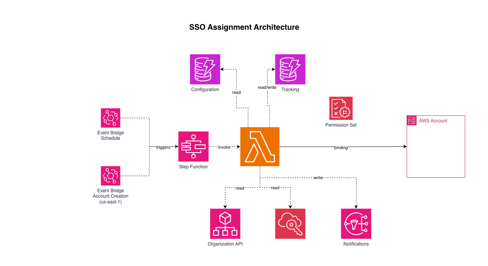

# Terraform AWS SSO Assignment

This Terraform module deploys automation for **AWS IAM Identity Center (SSO)** account assignments. You define **permission-set templates** in **DynamoDB** (via [`modules/config`](./modules/config/)): template name → list of permission set names.

**Account-level templates** allow you to auto-provision SSO assignments based on account **naming conventions**, **organizational units**, or **tags**. Account-level templates can bind **both groups and users** directly to accounts (useful for ad-hoc / one-off assignments).

**EventBridge** runs the flow on a schedule and on new account creation; **Step Functions** adds retries and optional **SNS** failure notifications.

Use it when you want repeatable, infrastructure-as-code driven SSO assignments across many accounts without hand-managing each assignment in the console.

## Features

- **Account-level templates** (NEW): Automatically apply templates to accounts matching **organizational unit paths**, **account name patterns**, or **account tags**. Uses logical AND matching: all conditions in a matcher must match for the template to apply.
- **Account-level user bindings**: Account-level templates can also include a `users` list, which assigns the template's permission sets directly to **Identity Center users** (resolved via Identity Store APIs). This is intended for **ad-hoc** access; at scale, prefer groups.
- **Declarative templates**: The [`modules/config`](./modules/config/) submodule writes templates and account matchers to DynamoDB.
- **Reconciliation**: Matching rules contribute bindings that are reconciled each run.
- **Two trigger modes**: Scheduled reconciliation (default `rate(180 minutes)`) and organization account-creation events (CloudTrail on `CreateAccount`).
- **Resilient orchestration**: Step Functions retries Lambda tasks (3 attempts, exponential backoff).
- **Optional alerting**: If you set `sns_topic_arn`, failed runs can publish error details to your existing SNS topic.
- **Optional event stream**: If you set `events_sns_topic_arn`, the Lambda publishes assignment lifecycle events (created/deleted) to your existing SNS topic.
- **Optional observability**: Set `enable_observability` to provision CloudWatch alarms across the Lambda, Step Function, triggers and DynamoDB tables, including a liveness alarm that fires when reconciliation silently stops. See [Observability](#observability).
- **Flexible operations**: Tune Lambda memory, timeout, runtime, log level, CloudWatch log retention, and DynamoDB billing mode.
- **Packaged handler**: Python Lambda source lives under [`assets/functions/`](./assets/functions/) (JSON logging, unit tests alongside the handler).

## Architecture



### Components

| Piece            | Role                                                                                                                                                                       |
| ---------------- | -------------------------------------------------------------------------------------------------------------------------------------------------------------------------- |
| Root module      | DynamoDB table, Lambda (via [terraform-aws-modules/lambda/aws](https://github.com/terraform-aws-modules/terraform-aws-lambda)), Step Functions, EventBridge rules and IAM. |
| `modules/config` | Populates DynamoDB: stores templates and account matchers.                                                                                                                 |
| Lambda           | Reads account details (OU path, name, tags), evaluates account matchers, and assigns permission sets to named IC groups (`assets/functions/handler.py`).                   |

## Usage

### Prerequisites

- Terraform **>= 1.0** and AWS provider **>= 6.0** (see `terraform.tf`).
- IAM Identity Center enabled; permission sets and groups already exist (this module assigns groups to accounts—it does not create permission sets or IdP groups).
- For `account_templates.users`, the referenced users must already exist in the Identity Store (Identity Center directory).
- Credentials with rights to deploy Lambda, DynamoDB, Step Functions, EventBridge, IAM, and (for the handler) SSO Admin, Organizations, and Identity Store actions.
- SSO instance ARN, for example:

  ```bash
  aws sso-admin list-instances --query 'Instances[0].InstanceArn' --output text
  ```

### Example 1 — Minimal stack (root module + config)

The root module creates the runtime; you almost always pair it with `modules/config` so DynamoDB contains your groups.

```hcl
locals {
  # Configuration with templates
  configuration = {
    templates = {
      default = {
        permission_sets = ["OrgReadOnly", "Developer-ReadOnly"]
        description     = "Baseline access — e.g. Grant/default = Platform-ReadOnly,App-Developers"
      }
      breakglass = {
        permission_sets = ["BreakGlassAdmin"]
        description     = "Use tag Grant/breakglass = SRE-Lead only where needed"
      }
    }
    # Optional: Account-level template matchers
    account_templates = {}
  }

  sso_instance_arn = "arn:aws:sso:::instance/ssoins-xxxxxxxx"
}

module "sso_assignment" {
  # Pin a ref in production, e.g. ?ref=v1.0.0 — or use a relative path as in examples/basic.
  source = "git::https://github.com/appvia/terraform-aws-sso-assignment.git"

  sso_instance_arn = local.sso_instance_arn
  tags = {
    Project = "sso-assignment"
  }
}

module "config" {
  source = "git::https://github.com/appvia/terraform-aws-sso-assignment.git//modules/config"

  dynamodb_table_arn = module.sso_assignment.config_dynamodb_table_arn
  configuration      = local.configuration
}
```

### Example 2 — Account-level templates with OU matching

Auto-provision production accounts with baseline permissions based on organizational unit:

```hcl
locals {
  configuration = {
    templates = {
      production = {
        permission_sets = ["Administrator", "ReadOnly"]
        description     = "Production account base permissions"
      }
      development = {
        permission_sets = ["Developer", "ReadOnly"]
        description     = "Development account permissions"
      }
    }
    account_templates = {
      prod_baseline = {
        description = "Auto-provision production accounts by OU"
        matcher = {
          # Matches accounts whose OU path matches the pattern.
          # OU paths are normalized to include a leading "/" before matching, so
          # patterns can (and should) include a leading "/".
          # This pattern matches e.g. "/production/accounts/prod-workload-1".
          organizational_units = ["/production/accounts/*"]
        }
        template_names = ["production"]
        groups         = ["ProdEngineers"]
        # Optional: direct user principals (account templates only)
        # users          = ["alice@example.com"]
      }

      dev_baseline = {
        description = "Auto-provision development accounts"
        matcher = {
          name_patterns = ["dev-*"]
        }
        template_names = ["development"]
        groups         = ["DevEngineers"]
        # users         = ["bob@example.com"]
      }
    }
  }

  sso_instance_arn = "arn:aws:sso:::instance/ssoins-xxxxxxxx"
}

module "sso_assignment" {
  source = "git::https://github.com/appvia/terraform-aws-sso-assignment.git"

  sso_instance_arn = local.sso_instance_arn
  tags = {
    Project = "sso-assignment"
  }
}

module "config" {
  source = "git::https://github.com/appvia/terraform-aws-sso-assignment.git//modules/config"

  dynamodb_table_arn = module.sso_assignment.config_dynamodb_table_arn
  configuration      = local.configuration
}
```

### Example 3 — Account-level templates with tag matching

Auto-provision any account with specific tags (all conditions must match):

```hcl
locals {
  configuration = {
    templates = {
      managed_baseline = {
        permission_sets = ["ReadOnly", "Audit"]
        description     = "Baseline managed permissions"
      }
    }
    account_templates = {
      managed_by_tags = {
        description = "Auto-provision accounts with management tags (AND logic)"
        matcher = {
          account_tags = {
            Environment = "Production"
            ManagedBySSO = "true"
          }
        }
        template_names = ["managed_baseline"]
        groups         = ["Operations"]
        # users        = ["platform-oncall@example.com"]
      }
    }
  }

  sso_instance_arn = "arn:aws:sso:::instance/ssoins-xxxxxxxx"
}
```

### Example 4 — Named resources, schedule, and failure notifications

Use `name` to prefix resources (default is `lz-sso`). Point `sns_topic_arn` at a topic you already manage; the state machine publishes there when the Lambda response includes errors.

```hcl
module "sso_assignment" {
  source = "git::https://github.com/appvia/terraform-aws-sso-assignment.git"

  name             = "my-org-sso"
  sso_instance_arn = local.sso_instance_arn
  step_function_schedule = "rate(30 minutes)"

  lambda_timeout  = 120
  lambda_memory   = 1024

  sns_topic_arn = aws_sns_topic.sso_alerts.arn

  tags = {
    Environment = "production"
  }
}

module "config" {
  source = "git::https://github.com/appvia/terraform-aws-sso-assignment.git//modules/config"

  dynamodb_table_arn = module.sso_assignment.config_dynamodb_table_arn
  configuration      = local.configuration
}
```

### Example 5 — Run the repository example

From the clone:

```bash
cd examples/basic
# Set local.sso_instance_arn in main.tf (or extend the example with tfvars)
terraform init
terraform plan
terraform apply
```

See [examples/basic/README.md](./examples/basic/README.md) for more detail.

### Example 6 — Assignment lifecycle SNS events (created/deleted)

To publish a generic event envelope for account assignment **creation** and **deletion**, provide an SNS topic ARN that already exists. This is **independent** of `sns_topic_arn` (Step Functions failure notifications).

```hcl
module "sso_assignment" {
  source = "git::https://github.com/appvia/terraform-aws-sso-assignment.git"

  sso_instance_arn = local.sso_instance_arn

  # Optional: publish lifecycle events (topic must already exist)
  events_sns_topic_arn = aws_sns_topic.assignment_events.arn
}
```

#### Event schema (SNS `Message`)

The Lambda publishes JSON with:

- `event_type`: `AccountAssignmentCreated` or `AccountAssignmentDeleted`
- `timestamp`: ISO-8601 UTC timestamp
- `detail`: metadata about the assignment (account, group/principal, permission set, template)

## Configuration

### Templates and Account Templates

The `configuration` variable (on `modules/config`) contains:

```hcl
configuration = {
  templates = {
    template_name = {
      permission_sets = ["PermissionSet1", "PermissionSet2"]
      description     = "Description of this template"
    }
  }

  account_templates = {
    matcher_name = {
      description = "Description of this account matcher"
      matcher = {
        # At least ONE of the following must be specified (others are optional)
        # All specified conditions must match (logical AND)

        organizational_units = ["/prod/*"]            # OU path glob patterns (leading "/" required; see matcher details below)
        name_patterns        = ["prod-*", ".*-prod"]  # Account name glob/regex patterns (ANY can match)
        account_tags         = {                                 # Account tags (all must match)
          Environment = "Production"
          ManagedBySSO = "true"
        }
      }
      template_names = ["template_name"]  # Which templates to apply
      groups         = ["GroupName"]      # Which groups from those templates
    }
  }
}
```

### Account Template Matcher Details

**Organizational Units** — Match by trailing OU path with glob patterns:

- The Lambda fetches the account's OU path from AWS Organizations (commonly like `/data/development`, but may also include a root id segment like `r-abc/...` depending on source).
- Before matching, the OU path is normalized to a consistent form with a single leading `/` (e.g. `r-abc/ou-prod/ou-workloads` becomes `/ou-prod/ou-workloads`).
- Patterns are matched against this normalized path using Python [`fnmatch`](https://docs.python.org/3/library/fnmatch.html) (shell-style globs: `*` matches any characters, `?` matches one character).
- **Include the leading `/` in your patterns** (e.g. `"/data/*"`). Patterns without a leading `/` are not supported.
- An account in OU `/data/development` is matched by `/data/*`, `/data/development`, or `/data/d*`.
- At least one pattern must match for the condition to pass.

**Account Name** — Match by account name with glob pattern:

- Single pattern string (e.g. `prod-*`)
- Uses fnmatch glob syntax

**Account Tags** — Match by account tags with AND logic:

- All specified tags must exist on the account
- All values must match exactly (case-sensitive)
- If no tags specified, this condition is skipped

### Migration from old `groups_configuration`

If you have existing Terraform using `groups_configuration` directly:

```hcl
# OLD (no longer supported)
module "config" {
  groups_configuration = {
    default = { ... }
  }
}

# NEW
module "config" {
  configuration = {
    templates = {
      default = { ... }
    }
    account_templates = {}  # Add account matchers here if desired
  }
}
```

### Configuration notes

- **`configuration`** (on `modules/config`): Contains `templates` (top-level keys are template names) and optional `account_templates` (name → matcher + template references). See [modules/config/README.md](./modules/config/README.md).
- **Duplicate assignments**: If multiple `account_templates` (or multiple `template_names` within them) result in the same effective assignment for an account (same account + permission set + principal), the Lambda will **keep the first** assignment encountered and **log a warning** for duplicates. Account templates and their referenced `template_names` are processed in **alphabetical order** to make this deterministic.

## Module layout

```
terraform-aws-sso-assignment/
├── main.tf                    # DynamoDB, Lambda, EventBridge rules and Pipe
├── step_function.tf           # State machine definition, role and policy
├── observability.tf           # CloudWatch alarms and log metric filters
├── data.tf                    # IAM policy documents
├── variables.tf, outputs.tf, locals.tf, terraform.tf
├── assets/functions/          # Lambda (handler.py, libs/, tests)
├── modules/config/            # DynamoDB item population
├── tests/                     # Terraform native tests
└── examples/basic/            # End-to-end sample
```

## Workflow behavior

1. **Schedule**: EventBridge invokes the Step Functions workflow on `step_function_schedule`; the Lambda lists target accounts, reads each account’s OU path and tags, evaluates account templates, reads each account’s `<prefix>/*` tags, and reconciles assignments against DynamoDB templates.
2. **New account**: An EventBridge rule matches Organizations `CreateAccount` CloudTrail events and starts the same state machine so new accounts can be included in the next reconciliation.

### Region note (important): Organizations `CreateAccount` events are in `us-east-1`

The **account-creation trigger** relies on the CloudTrail event `CreateAccount` (detail-type: `AWS API Call via CloudTrail`, source: `aws.organizations`). For AWS Organizations, this event is emitted/observable via EventBridge in **`us-east-1`**.

That means:

- **If you deploy this module outside `us-east-1`**, the module’s built-in `account_creation` EventBridge rule in that region **will not see** the `CreateAccount` events, so the “new account” trigger won’t fire from that region.
- **To enable the account-creation trigger when the module is deployed elsewhere**, create an **additional** EventBridge rule + target in **`us-east-1`** that starts the exported Step Functions state machine using the exported invoke role.

The module already exports what you need:

- `step_function_arn`
- `eventbridge_invoke_role_arn` (this is the role EventBridge assumes to start the state machine)
  - Note: this module output is intentionally named **`eventbridge_invoke_role_arn`** (not `eventbridge_role_invoke_arn`)

#### Example: Create the `us-east-1` EventBridge rule/target (when module is deployed in another region)

```hcl
# Configure a second AWS provider for us-east-1
provider "aws" {
  alias  = "use1"
  region = "us-east-1"
}

module "sso_assignment" {
  source = "git::https://github.com/appvia/terraform-aws-sso-assignment.git"

  # Deploy the module in your chosen region (not us-east-1 in this example)
  # provider = aws  # default provider

  sso_instance_arn        = var.sso_instance_arn
  step_function_schedule  = "rate(180 minutes)"
  # ... other inputs ...
}

# Mirror the module's CreateAccount rule in us-east-1
resource "aws_cloudwatch_event_rule" "sso_assignment_account_creation_use1" {
  name           = "sso-assignment-account-creation-use1"
  description    = "Triggers sso-assignment Step Function on Organizations CreateAccount (must be in us-east-1)"
  event_bus_name = "default"
  state          = "ENABLED"

  event_pattern = jsonencode({
    source      = ["aws.organizations"]
    detail-type = ["AWS API Call via CloudTrail"]
    detail = {
      eventName   = ["CreateAccount"]
      eventSource = ["organizations.amazonaws.com"]
    }
  })

  provider       = aws.use1
}

resource "aws_cloudwatch_event_target" "sso_assignment_account_creation_use1" {
  rule     = aws_cloudwatch_event_rule.sso_assignment_account_creation_use1.name
  arn      = module.sso_assignment.step_function_arn
  role_arn = module.sso_assignment.eventbridge_invoke_role_arn

  provider = aws.use1
}
```

### Configuration updates (`enable_config_triggers`)

By default, the root module enables **configuration update triggers** (`enable_config_triggers = true`). When enabled, updates to the DynamoDB **config** table (populated by `modules/config`) will automatically trigger the Step Functions workflow so changes are reconciled without waiting for the next schedule.

- **How it works**: DynamoDB Streams on the config table → EventBridge Pipes (`aws_pipes_pipe.config_update`) → Step Functions (`invocation_type = "FIRE_AND_FORGET"`).
- **What gets triggered**: the state machine is started with an input payload like:

```json
{
  "source": "config_update",
  "account_id": "<from DynamoDB stream record>",
  "dry_run": "true|false",
  "region": "<event region>",
  "time": "<event time>"
}
```

- **Dry-run support**: if `enable_dry_run = true` on the root module, the trigger still fires but the Lambda will skip write actions.
- **Disable if undesired**: set `enable_config_triggers = false` to remove the DynamoDB stream, pipe, and its log group (you’ll still have schedule + account-creation triggers).

For low-level steps (retries, SNS on failure), inspect `step_function.tf` and `assets/functions/handler.py`.

## Deployment

```bash
terraform init
terraform plan
terraform apply
```

### Verify

```bash
TABLE_NAME=$(terraform output -raw config_dynamodb_table_name)
aws dynamodb describe-table --table-name "$TABLE_NAME"

FN=$(terraform output -raw lambda_function_name)
aws lambda get-function --function-name "$FN"

SF=$(terraform output -raw step_function_arn)
aws stepfunctions describe-state-machine --state-machine-arn "$SF"
```

## IAM (high level)

The module defines IAM for Lambda (DynamoDB read, SSO/Identity Store/Organizations APIs including `ListTagsForResource` on member accounts, logs, and optional `sns:Publish` when `events_sns_topic_arn` is set), Step Functions (invoke Lambda, optional SNS publish via `sns_topic_arn`), and EventBridge (start execution). Exact policies are in `data.tf` and `step_function.tf`.

## Observability

This module is a control plane for account access: when it stops working, access drifts and
nobody finds out until someone cannot log in. Setting `enable_observability = true` provisions
CloudWatch alarms across every component in the chain. It is off by default, so existing
deployments are unaffected until you opt in.

```hcl
module "sso_assignment" {
  source = "github.com/appvia/terraform-aws-sso-assignment?ref=v1.0.0"

  sso_instance_arn = "arn:aws:sso:::instance/ssoins-1234567890abcdef"

  # Provision the alarms and log metric filters
  enable_observability = true

  # Existing topics notified on alarm and on recovery. The module does not create these.
  # Leave empty to create the alarms without notifications.
  alarm_sns_topic_arns = ["arn:aws:sns:eu-west-2:123456789012:platform-alarms"]
}
```

### What is alarmed

| Alarm | Source | Fires when |
| ----- | ------ | ---------- |
| `<name>-handler-errors` | Log metric filter | The handler logs an `ERROR` level line |
| `<name>-identity-resolution-failures` | Log metric filter | A group, user or permission set named in configuration cannot be resolved in Identity Center |
| `<name>-step-function-executions-failed` | `AWS/States` | A reconciliation run finished with errors |
| `<name>-step-function-executions-timed-out` | `AWS/States` | A run exceeded the state machine timeout |
| `<name>-step-function-no-executions` | `AWS/States` | **No run has started at all** within `alarm_execution_staleness_period_seconds` |
| `<name>-lambda-errors` | `AWS/Lambda` | An invocation was killed by timeout, out of memory, or an init failure |
| `<name>-lambda-throttles` | `AWS/Lambda` | An invocation was rejected by concurrency limits |
| `<name>-lambda-duration` | `AWS/Lambda` | Runtime exceeded `alarm_duration_threshold_percent` of `lambda_timeout` |
| `<name>-eventbridge-<rule>-failed-invocations` | `AWS/Events` | A rule could not start the Step Function. One alarm per enabled rule |
| `<name>-pipes-execution-failed` | `AWS/Pipes` | The config table Pipe could not start the Step Function. Only when `enable_config_triggers` is true |
| `<name>-dynamodb-<table>-throttled-requests` | `AWS/DynamoDB` | Either table throttled requests, leaving reconciliation with an incomplete view |

Between eleven and thirteen alarms depending on which triggers are enabled, plus two custom
metrics. At the top end that is roughly **$1.90/month** ($0.10 per alarm, $0.30 per metric).

### Why the log metric filters matter

The Lambda handler catches every exception and *returns* a result document rather than raising,
because the Step Function's `EvaluateResponse` state inspects the returned `errors` field to
decide success or failure. A consequence is that the `AWS/Lambda` `Errors` metric stays at zero
for application-level failures — it only moves for timeouts, out of memory kills and init
failures.

The two `aws_cloudwatch_log_metric_filter` resources recover that signal from the structured
JSON logs the handler already emits, without changing its contract:

- `{ $.level = "ERROR" }` → `HandlerErrors`
- `{ $.level = "WARNING" && $.action = "build_permissions" }` → `IdentityResolutionFailures`

The second is worth calling out. When an account tag names a group that no longer exists in
Identity Center, the handler logs a warning, records a failure and carries on. The run still
reports a status — but the intended access was never granted. That alarm is how you find out.
Set `alarm_identity_resolution_threshold` above `0` if your estate has known-stale references
you have chosen to live with.

Metrics are published to `alarm_metric_namespace`, `Appvia/SSOAssignment` by default.

### The liveness alarm

`<name>-step-function-no-executions` is the one alarm that catches a *silent* failure: a
disabled EventBridge rule, a broken invoke role, or a dead Pipe. Every other alarm needs
something to go wrong loudly; this one fires on the **absence** of runs, using
`treat_missing_data = "breaching"`.

Its evaluation period is `alarm_execution_staleness_period_seconds`, default `21600` (6 hours,
twice the default schedule). `step_function_schedule` is a free-form expression that cannot be
parsed reliably in Terraform, so **if you shorten the schedule you must set this yourself** —
keep it comfortably above the schedule interval to avoid false positives, and below the point
at which you would want to know reconciliation had stopped.

### Log level

`log_level` sets the `LOG_LEVEL` environment variable on the Lambda (default `INFO`). Individual
invocations can still override it by passing `logging_level` in the event, which is useful for
one-off debugging without redeploying:

```bash
SF=$(terraform output -raw step_function_arn)
aws stepfunctions start-execution --state-machine-arn "$SF" \
  --input '{"source":"cron_schedule","logging_level":"DEBUG"}'
```

### Inspecting the logs directly

```bash
LG=$(terraform output -raw lambda_cloudwatch_log_group_name)

# Errors in the last hour
aws logs filter-log-events --log-group-name "$LG" --start-time $(( ($(date +%s) - 3600) * 1000 )) \
  --filter-pattern '{ $.level = "ERROR" }'

# Identities that could not be resolved
aws logs filter-log-events --log-group-name "$LG" --start-time $(( ($(date +%s) - 3600) * 1000 )) \
  --filter-pattern '{ $.level = "WARNING" && $.action = "build_permissions" }'
```

## Troubleshooting

### No assignments created

- Confirm `module.config` has been applied and `aws dynamodb scan --table-name <name>` shows items for your templates.
- Check CloudWatch logs for the Lambda function to see if templates are loading correctly.
- Verify account templates matcher conditions are correct: all conditions in a matcher must match for the template to apply.

### Account template not matching

- Check account OU path: Use `aws organizations list-parents --child-id <account-id>` and build the full path
- **OU pattern format**: OU matching uses `fnmatch` against a normalized OU path with a leading `/` (e.g. `/data/development`). Patterns must include a leading `/`, e.g. `"/data/*"`.
- Check account name: Use `aws organizations describe-account --account-id <account-id>`
- Check account tags: Use `aws organizations list-tags-for-resource --resource-id <account-id>`
- Enable DEBUG logging: set `log_level = "DEBUG"`, or pass `"logging_level": "DEBUG"` in the Step Function input for a one-off run, then check the Lambda CloudWatch logs for detailed matcher debug output

### No assignments for an account

- It may have no `<prefix>/*` tags or matching account templates
- If using account templates, verify the matcher conditions all pass
- Confirm tag value group names match Identity Center **DisplayName** exactly (case-sensitive)
- Confirm with `aws identitystore list-groups` / console

### Timeouts

- Increase `lambda_timeout` (and possibly `lambda_memory`) for large organizations.

### SNS

- Ensure `sns_topic_arn` is set, the topic exists, and the Step Functions role can publish to it.

## Contributing

Contributions are welcome via issues and pull requests.

## License

See [LICENSE](./LICENSE).

<!-- BEGIN_TF_DOCS -->
## Providers

| Name | Version |
|------|---------|
| <a name="provider_aws"></a> [aws](#provider\_aws) | >= 6.0.0 |

## Inputs

| Name | Description | Type | Default | Required |
|------|-------------|------|---------|:--------:|
| <a name="input_sso_instance_arn"></a> [sso\_instance\_arn](#input\_sso\_instance\_arn) | ARN of the AWS SSO instance | `string` | n/a | yes |
| <a name="input_alarm_duration_threshold_percent"></a> [alarm\_duration\_threshold\_percent](#input\_alarm\_duration\_threshold\_percent) | Percentage of lambda\_timeout at which the Lambda duration alarm triggers | `number` | `80` | no |
| <a name="input_alarm_execution_staleness_period_seconds"></a> [alarm\_execution\_staleness\_period\_seconds](#input\_alarm\_execution\_staleness\_period\_seconds) | Period in seconds over which an absence of Step Function executions raises the liveness alarm. Must be comfortably longer than step\_function\_schedule | `number` | `21600` | no |
| <a name="input_alarm_identity_resolution_threshold"></a> [alarm\_identity\_resolution\_threshold](#input\_alarm\_identity\_resolution\_threshold) | Number of identity resolution warnings (groups, users or permission sets missing from Identity Center) tolerated before alarming | `number` | `0` | no |
| <a name="input_alarm_metric_namespace"></a> [alarm\_metric\_namespace](#input\_alarm\_metric\_namespace) | CloudWatch namespace for the custom metrics extracted from the Lambda logs | `string` | `"Appvia/SSOAssignment"` | no |
| <a name="input_alarm_sns_topic_arns"></a> [alarm\_sns\_topic\_arns](#input\_alarm\_sns\_topic\_arns) | ARNs of existing SNS topics to notify on alarm and recovery. These topics are NOT created by this module | `list(string)` | `[]` | no |
| <a name="input_cloudwatch_logs_kms_key_id"></a> [cloudwatch\_logs\_kms\_key\_id](#input\_cloudwatch\_logs\_kms\_key\_id) | KMS key ID for CloudWatch logs | `string` | `null` | no |
| <a name="input_cloudwatch_logs_log_group_class"></a> [cloudwatch\_logs\_log\_group\_class](#input\_cloudwatch\_logs\_log\_group\_class) | The class of the CloudWatch log group | `string` | `"STANDARD"` | no |
| <a name="input_cloudwatch_logs_retention_in_days"></a> [cloudwatch\_logs\_retention\_in\_days](#input\_cloudwatch\_logs\_retention\_in\_days) | The number of days to retain the CloudWatch logs | `number` | `30` | no |
| <a name="input_dynamodb_billing_mode"></a> [dynamodb\_billing\_mode](#input\_dynamodb\_billing\_mode) | DynamoDB billing mode (PAY\_PER\_REQUEST or PROVISIONED) | `string` | `"PAY_PER_REQUEST"` | no |
| <a name="input_dynamodb_encryption_enabled"></a> [dynamodb\_encryption\_enabled](#input\_dynamodb\_encryption\_enabled) | Enable server-side encryption for DynamoDB tables (will use AWS managed KMS key by default) | `bool` | `false` | no |
| <a name="input_dynamodb_kms_key"></a> [dynamodb\_kms\_key](#input\_dynamodb\_kms\_key) | Optional KMS key ID for DynamoDB encryption | `string` | `null` | no |
| <a name="input_dynamodb_point_in_time_recovery_enabled"></a> [dynamodb\_point\_in\_time\_recovery\_enabled](#input\_dynamodb\_point\_in\_time\_recovery\_enabled) | Enable point-in-time recovery for DynamoDB tables (for both tables) | `bool` | `false` | no |
| <a name="input_dynamodb_point_in_time_recovery_retention_period"></a> [dynamodb\_point\_in\_time\_recovery\_retention\_period](#input\_dynamodb\_point\_in\_time\_recovery\_retention\_period) | The number of days to retain the DynamoDB point-in-time recovery | `number` | `7` | no |
| <a name="input_enable_account_triggers"></a> [enable\_account\_triggers](#input\_enable\_account\_triggers) | Enable EventBridge rules to trigger Lambda when AWS Organizations account creation events are detected (Only available in the us-east-1 region) | `bool` | `false` | no |
| <a name="input_enable_config_triggers"></a> [enable\_config\_triggers](#input\_enable\_config\_triggers) | Enable EventBridge Pipes to trigger Lambda when config table is updated | `bool` | `true` | no |
| <a name="input_enable_dry_run"></a> [enable\_dry\_run](#input\_enable\_dry\_run) | When true, triggers run the Lambda in dry-run (noop) mode | `bool` | `false` | no |
| <a name="input_enable_observability"></a> [enable\_observability](#input\_enable\_observability) | Enable CloudWatch alarms and log metric filters covering the Lambda, Step Function, triggers and DynamoDB tables | `bool` | `false` | no |
| <a name="input_events_sns_topic_arn"></a> [events\_sns\_topic\_arn](#input\_events\_sns\_topic\_arn) | Optional ARN of an existing SNS topic to publish assignment creation/deletion events from the Lambda (if null, event publishing disabled). This topic is NOT created by this module. | `string` | `null` | no |
| <a name="input_lambda_memory"></a> [lambda\_memory](#input\_lambda\_memory) | Lambda function memory allocation in MB | `number` | `512` | no |
| <a name="input_lambda_runtime"></a> [lambda\_runtime](#input\_lambda\_runtime) | Lambda function runtime | `string` | `"python3.14"` | no |
| <a name="input_lambda_timeout"></a> [lambda\_timeout](#input\_lambda\_timeout) | Lambda function timeout in seconds | `number` | `300` | no |
| <a name="input_log_level"></a> [log\_level](#input\_log\_level) | Log level for the Lambda function. Callers can still override this per invocation via the event's logging\_level field | `string` | `"INFO"` | no |
| <a name="input_name"></a> [name](#input\_name) | Name for all resources i.e. handler, lambda, step function, event bridge, etc. | `string` | `"lz-sso"` | no |
| <a name="input_sns_topic_arn"></a> [sns\_topic\_arn](#input\_sns\_topic\_arn) | ARN of SNS topic for Step Function notifications (if null, notifications disabled) | `string` | `null` | no |
| <a name="input_step_function_schedule"></a> [step\_function\_schedule](#input\_step\_function\_schedule) | EventBridge cron/rate schedule for Lambda execution | `string` | `"rate(180 minutes)"` | no |
| <a name="input_tags"></a> [tags](#input\_tags) | Common tags to apply to all resources | `map(string)` | `{}` | no |
| <a name="input_trigger_on_package_timestamp"></a> [trigger\_on\_package\_timestamp](#input\_trigger\_on\_package\_timestamp) | When true, the Lambda is triggered to redeploy when the package timestamp changes (useful for CI/CD pipelines) | `bool` | `false` | no |

## Outputs

| Name | Description |
|------|-------------|
| <a name="output_cloudwatch_alarm_arns"></a> [cloudwatch\_alarm\_arns](#output\_cloudwatch\_alarm\_arns) | Map of alarm name to ARN for the CloudWatch alarms provisioned when enable\_observability is true, empty otherwise |
| <a name="output_config_dynamodb_table_arn"></a> [config\_dynamodb\_table\_arn](#output\_config\_dynamodb\_table\_arn) | ARN of the DynamoDB table storing group configurations |
| <a name="output_config_dynamodb_table_name"></a> [config\_dynamodb\_table\_name](#output\_config\_dynamodb\_table\_name) | Name of the DynamoDB table storing group configurations |
| <a name="output_eventbridge_invoke_role_arn"></a> [eventbridge\_invoke\_role\_arn](#output\_eventbridge\_invoke\_role\_arn) | ARN of EventBridge roles for account creation and cron schedule |
| <a name="output_eventbridge_rule_arns"></a> [eventbridge\_rule\_arns](#output\_eventbridge\_rule\_arns) | ARNs of EventBridge rules for account creation and cron schedule |
| <a name="output_eventbridge_rule_names"></a> [eventbridge\_rule\_names](#output\_eventbridge\_rule\_names) | Names of EventBridge rules for account creation and cron schedule |
| <a name="output_lambda_cloudwatch_log_group_arn"></a> [lambda\_cloudwatch\_log\_group\_arn](#output\_lambda\_cloudwatch\_log\_group\_arn) | ARN of the CloudWatch log group receiving the Lambda function logs |
| <a name="output_lambda_cloudwatch_log_group_name"></a> [lambda\_cloudwatch\_log\_group\_name](#output\_lambda\_cloudwatch\_log\_group\_name) | Name of the CloudWatch log group receiving the Lambda function logs |
| <a name="output_lambda_function_arn"></a> [lambda\_function\_arn](#output\_lambda\_function\_arn) | ARN of the Lambda function for SSO group assignment |
| <a name="output_lambda_function_name"></a> [lambda\_function\_name](#output\_lambda\_function\_name) | Name of the Lambda function for SSO group assignment |
| <a name="output_lambda_policy_json"></a> [lambda\_policy\_json](#output\_lambda\_policy\_json) | IAM policy document (JSON) attached to the Lambda role via policy\_json |
| <a name="output_step_function_arn"></a> [step\_function\_arn](#output\_step\_function\_arn) | ARN of the Step Function state machine orchestrating SSO assignments |
| <a name="output_tracking_dynamodb_table_arn"></a> [tracking\_dynamodb\_table\_arn](#output\_tracking\_dynamodb\_table\_arn) | ARN of the DynamoDB table tracking managed SSO assignments |
| <a name="output_tracking_dynamodb_table_name"></a> [tracking\_dynamodb\_table\_name](#output\_tracking\_dynamodb\_table\_name) | Name of the DynamoDB table tracking managed SSO assignments |
<!-- END_TF_DOCS -->
